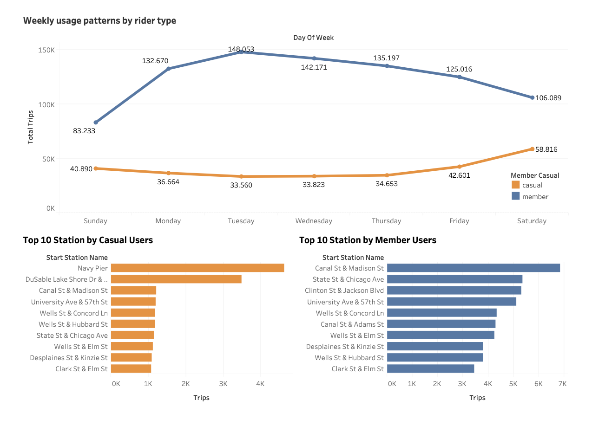

# 📊 Business & Accounting Analytics Case Study: Bike Sharing

## 👋 About Me
I’m a Senior Accountant with 6+ years of experience working with US, Australian, and Argentinian companies.  

I specialize in financial operations and general accounting tasks and I’m currently expanding into data analytics to leverage financial and operational data for better decision-making.

---

## 📌 Business Problem
Cyclistic, a bike-sharing company, lacked visibility into behavioral differences between casual riders and annual members.  

This limited the company’s ability to design effective strategies to convert casual users into recurring members and increase long-term revenue.

---

## 🎯 Objective
Analyze historical trip data to identify behavioral patterns and provide actionable, data-driven recommendations to increase membership conversion rates.

---

## 🗂 Data Source
The dataset consists of Cyclistic’s historical trip data, provided by Motivate International Inc. under an open data license. For my analisis I worked with the last 5 months.

It includes:
- Ride timestamps (start/end)
- Trip duration
- Station names and IDs
- Bike type
- User type (casual vs member)

⚠️ Note: No personally identifiable information (PII) is included, limiting user-level tracking.

---

## 🛠 Tools Used
- SQL (BigQuery)
- Tableau
- Excel / CSV

---

## 🔍 Process 

- Combined multiple monthly datasets into one unified table 
- Cleaned data and removed null values - Analyzed user behavior (casual vs members) 
- Identified trends by user type, time, and location 
- Translated operational data into business-relevant insights 
- Built a dashboard to support decision-making

---

## 📊 Key Insights
- Casual users ride more on weekends and for longer periods (leisure)
- Members primarily use bikes on weekdays and shorter average times of riding (commuting)
- Certain stations concentrate the majority of trips
- Usage variability highlights opportunities for demand-based optimization

---

## 📸 Dashboard
This dashboard highlights key behavioral differences between casual riders and members.

---

## 💰 Financial & Business Impact
- Supports **revenue growth strategies** through membership conversion
- Improves **forecasting accuracy** using usage trends
- Enables **cost optimization** via better asset allocation
- Provides insights for **pricing and retention strategies**

---

## 💡 Recommendations

### 1. Introduce Flexible Membership Plans
- Weekend passes or short-term subscriptions
- Lower entry barrier for casual users
- Encourage transition to recurring revenue

---

### 2. Target High-Traffic Locations
- Focus marketing on recreational and tourist areas
- Use in-app messaging and station-based promotions
- Leverage peak weekend activity

---

### 3. Incentivize Weekday Usage
- Offer discounts or commuter packages
- Promote biking as a daily transportation option
- Encourage habit formation similar to members

---

## 📈 Business Impact
- Potential to increase membership conversion by targeting high-frequency casual users and optimizing pricing strategies.

---

## 📂 Project Files
-🔎 SQL Analysis: 
Check the full SQL queries used in this project:  
👉 [View SQL Queries](sql/queries.sql)

---

## 🚀 Next Steps
- Integrate pricing and revenue data for profitability analysis
- Develop financial KPIs (LTV, CAC, utilization rate)
- Build predictive models for demand forecasting
